_Laszlo Treszkai (firstname.lastname@gmail.com)_

Version of 11 November, 2019.

This document might be revised in the future; any potential updates will be linked from here.

## Abstract

### Background

Multiple observational studies claim that the daylight savings time (DST) adjustment in spring causes an increase in acute myocardial infarction (AMI) count during the following days or weeks, attributing this increase to the reduction in sleep or the disturbance in the circadian rhythm. Previous studies used frequentist methods for interval estimation and often showed “statistically significant” differences, although the results were inconsistent and sometimes the effects in the same study were incoherent (such as a significant difference on Tuesday but not on Monday). A recent meta-analysis used frequentist methods and showed an increase in incidence rate after the spring adjustment and could not show a change after the autumn adjustment.

### Methods

This study reanalyzes the data described in the relevant observational studies. We propose a Bayesian model that should capture the alleged phenomenon truthfully, apply this model consistently to every study, and combine the results using a fixed-effects model. Under our model, the risk ratio on Monday is the highest, it is slightly lower on Tuesday, and it decreases linearly to 1 until Saturday. We do the calculations using both analytic methods and Monte Carlo methods with the Stan software.

### Results

In total, 7 observational studies were identified and analyzed, from which one was excluded. The remaining 6 studies included 14,024 AMI incidences on the week following spring DST adjustment, and 15,921 incidences on the week following autumn DST adjustment.
Together with related trend data obtained from the surrounding weeks, these figures show a risk ratio (RR) of 107.7% on the Monday following a spring DST change (95% credible interval: \[104.8%, 110.7%\]), and a mean RR of 97.7% (95% CrI: \[95.1%, 100.3%\]) after the autumn DST change. The results from analytic and Monte Carlo methods matched precisely. The credible intervals obtained from a non-informative prior yield practically the same results, and so does a slightly more complex model for the time decay of the effect.

### Conclusion

Overall, the spring DST adjustment has a small but quasi-certain positive effect on AMI incidences, and the risk ratio in autumn is approximately 1 or slightly less than 1.
We note that the combined RR is less than half of what has been suggested by certain smaller but highly cited studies, but our analysis shows larger effects than the recent meta-analysis of the same data by Manfredini et al. (2019).
Our results give strong support to the hypothesis that the DST transitions – especially the spring transition when sleep is reduced – have a noticeable effect on our circadian rhythm.
Nonetheless, we cannot confidently claim that these results are of direct practical importance: there is no evidence that the additional AMI counts in the days after DST transition are not merely shifted earlier from the following weeks.

---------------------

## Introduction

This study has a two-fold purpose. First, it compiles all the published data about the effects of DST on the risk of AMI, and presents a meta-analysis where the data from multiple countries and years is analyzed in a unified model. On the other hand, it demonstrates the use of Bayesian methods in an analysis or meta-analysis, explaining the thinking behind model specification and quantifying our prior beliefs about the parameters. The software required for reproducing this paper is freely available at <https://github.com/treszkai/BayesianScience>.

Sipilä et al. (2016) explain the importance of sleep and its effects on the risk of heart disease:

> Sleep is essential for well-being and its disturbances
have been associated with disruption of numerous
physiological processes and changes in cardiovascular
risk factors (1,2). Sleep disordered breathing has been
associated with risk of coronary heart disease (3,4) and
sleep impairment with prognosis of myocardial infarction
(MI) (5).

> Daylight saving time (DST) is used in many countries
including the United States and the members of
the European Union for prolonging of sun-light
proportion of day. Clock shifts however alter and disrupt
chronobiological rhythms and impair sleep (7,8) providing
a ‘‘natural experiment’’ for studying the effects of
rhythm and sleep disruptions on the incidence of
vascular events. Although chronobiological factors
have been shown to affect the incidence of MI (9,10),
studies on the association of DST and the incidence of MI
have been partly conflicting. With one exception (11), all
studies show changes in the temporal distribution of MI
in the week following DST transitions but the patterns of
change differ (12–15) and there is no agreement about
the impact of these changes on the overall incidence of
MI (11–16).

We will see that there is a simple reason for the disagreement between studies: most of the studies have been critically underpowered.

Although the majority of medical research uses frequentist methods, this is not the first meta-analysis in medicine that uses Bayesian statistics. The following are some noteworthy examples:
- Gelman et al. (2013) present an example for estimating mortality ratios after a myocardial infarction between the control group and a group that uses beta-blockers, using data from 22 independent studies.
- Devin Incerti (2015) provides a Bayesian re-analysis of the effects of mammography on breast cancer-related mortality rates.
- Yang et al. (2017) analyze 25 randomized controlled trials of prokinetics for the treatment of functional dyspepsia in a Bayesian network meta-analysis.

### Methodology shared in most papers

Following the naming of (Čulić 2013), we refer to the week following the DST adjustment as “posttransitional week”.

Every study that was included compares the observed AMI counts against a trend prediction. The trend prediction for AMI counts on given days – sometimes called “control group” – was usually defined as the average of the respective days on the two weeks before and after the posttransitional week. The analysis of Sandhu et al. (2014) was the only exception, as they used a regression model that included AMIs from all year except the two weeks following the spring and autumn DST adjustments.

Years on which the DST adjustment coincided with Easter were usually excluded from the studies. If Easter fell on the 2 weeks following (or preceding) the DST adjustment, the control period was the two out of three weeks that did not include Easter.

Every paper adjusted the AMI counts for the shorter (resp. longer) Sunday following a spring (resp. autumn) DST transition by multiplying the real counts with \(24/23\) (resp. \(24/25\)). This sometimes resulted in fractional AMI counts, which we rounded to the nearest integer when treated as an observation.

## Materials and methods

### Study selection

We analyzed data from every study that was included in the meta-analysis of Manfredini et al. (2019).

Performing a PubMed search instead of using the list of publications from (Manfredini et al. 2019) would be a tedious process with little benefit: said meta-analysis retrieved 2633 papers dated up to 31 December 2018 (from which 7 were relevant).

### Analyzed data

From each paper, we extracted the trend predictions and the actual AMI counts on each day of the spring and autumn posttransitional weeks. When the trend prediction was not available, we divided the total number of AMI cases by the study length in days. We restricted our analysis to the number of incidences, and ignored all variables that describe incidences, such as age and gender of patient, STEMI (ST elevation MI) or non-STEMI, or various medications taken prior to the incident.

### Problems with standard statistical tests

The standard statistical practice for deciding whether there is a difference in a particular variable (such as AMI counts) between two groups is to use a _null hypothesis significance test_ (NHST).
Using this method, one defines a _null hypothesis_ as the variable of interest having some predetermined value, which in this case would correspond to zero increase in AMI counts after a DST change.
The NHST answers the question: assuming the null hypothesis is true, what is the probability that data which is generated according to the sampling and testing intentions has a more extreme test statistic than that of the actual observations (Kruschke, Liddell 2018). If this probability is less than some fixed threshold (typically 0.05), the effect is claimed to exist.
The NHST suffers from a multitude of problems, and has received its fair share of criticism from statisticians.
It encourages black-and-white thinking without allowing uncertainty (claiming that an effect either exists or not, depending on the p-value), it encourages binary classification of effects without quantifying the relationship (_statistically_ significant differences might be of no _practical_ relevance if they are small), and these tests are conducted _against_ a given null hypothesis without any way to gain evidence _for_ the null hypothesis (an inability to refute the null hypothesis is not equal to accepting it).
Recently, The American Statistician released a special issue titled _Moving to a World Beyond “p < 0.05”_ (Wasserstein 2019), together with commentaries from 94 authors.

We can get a more accurate sense of the value of the parameter if instead of testing a hypothesis, we estimate the value of the parameter. The standard tool for this is stating the 95% confidence interval (CI) for a parameter, which is the set of parameter values that wouldn’t be rejected at the \(p<0.05\) level. This is the approach suggested by Cumming (2014) and Cumming and Calin-Jageman (2016), who call it the _New Statistics_.

While reporting intervals is better than a single value from it (i.e. the p-value), confidence intervals still suffer from deep-rooted flaws. It still encourages black-and-white thinking: parameter values inside the CI are compatible with the null hypothesis, those outside it are not. Confidence intervals do not give distributional information, i.e. a value close to the limits of the CI is not "less compatible" with the hypothesis then a value in the middle, nor is a study of large sample size "more confident" than a smaller study (although usually the CI of a large study is narrower). This binary nature makes it hard to aggregate the results of multiple studies and to perform a meta-analysis accurately. In addition, confidence intervals are also frequently misinterpreted: specifically, the true parameter value is _not_ 95% likely to be inside the CI, although they are often thought to be.

Kruschke and Liddell (2018) compare approaches to statistical inference along two axes: whether the method uses a frequentist or Bayesian framework, and whether the method compares hypotheses or estimates parameter values. They make a detailed case that Bayesian parameter estimation is superior in most situations to the frequentist methods or Bayesian hypothesis testing, hence the title of the paper, _The Bayesian New Statistics_.

### Overview of our model and statistical methods

In this meta-analysis we define a (Bayesian) statistical model for the parameter of interest and our observations. For every paper, we have the following observations: the AMI counts on each day of the posttransitional week, and the AMI counts predicted by the trend. The unobserved parameter is the risk ratio (RR), i.e. the multiplier by which mean AMI counts increase in the posttransitional week, compared to the same day of an ordinary week. Our description of this parameter initially also include some reasonable uncertainty in our beliefs, quantified in the _prior distribution_. The goal of the analysis is to derive the _posterior probability distribution_ of the RR (or _posterior_ for short), which is an adjustment of the prior probabilities based on the likelihood of each parameter value, i.e. the probability that a given parameter value would produce the observed data. Although the posterior is influenced by the prior and the statistical model, this influence can be insubstantial in the face of enough data, as will be the case in this analysis. Finally, the posterior is summarized in a 95% credible interval of parameter values, which is either a central credible interval or a highest density posterior interval.

### Notation

For a particular study \(s\), \(t_i^{(s)}\) denotes the AMI counts as predicted by the trend model on day \(i\) of the posttransitional week (with \(d = 1,\,\ldots,\,5\) for Monday, …, Friday after the DST change) and \(y_d^{(s)}\) denotes the observed count on day \(i\). The (unobserved) mean of the distribution of \(y_d^{(s)}\) is denoted by \(x_d^{(s)}\) – the meaning of this variable will become clear in the next section.
The risk ratio for day \(d\) is denoted by \(r_d^{(s)} = x_d^{(s)} / t_d^{(s)}\). Finally, \(\mathcal D^{(s)}\) denotes the whole dataset, i.e. all of the observations \(\{y_1^{(s)},\ldots,y_5^{(s)}\}\). To avoid cluttered notation, sometimes the superscript is omitted, resulting in e.g. \(y_1\).

### Poisson distribution

The [Poisson distribution](https://en.wikipedia.org/wiki/Poisson_distribution) is a discrete probability distribution that expresses the probability of a given number of events occurring in a fixed interval of time or space if these events occur with a known constant rate and independently of the time since the last event. In our case, the “event” is an AMI, and the fixed interval of time is a day. Although AMIs don't happen at a constant rate throughout the day, the [sum of Poisson-distributed random variables](https://en.wikipedia.org/wiki/Poisson_distribution#Sums_of_Poisson-distributed_random_variables) is also Poisson-distributed, so any day's total will also be Poisson-distributed.

The distribution has a single parameter, which is a positive real number, and is often denoted \(λ\). The mean (expected value) of \(\text{Poisson}(λ)\) is \(λ\), and the standard deviation is \(\sqrt{λ}\). Its probability mass function is shown below for \(λ=100\), along with the 95% highest density interval (HDI) – the shortest interval that covers 95% of the probability mass.

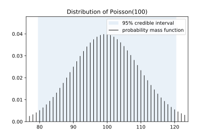

The analyzed studies reported the sum of AMIs on a given day over the period of the study (e.g. all posttransitional Tuesdays during the years 2010–2013), never the AMI counts for individual years. This sum is denoted with \(y_d\), where \(d\) signifies the day. We note again that the individual counts are each Poisson-distributed, so their sum is Poisson-distributed too. (However, their _average_ would not be Poisson-distributed.) This means that \(y_d\) is sampled from a Poisson distribution whose parameter \(x_d\) is the sum of the trend on day \(d\) over the period of the study (\(t_d\)), multiplied with the RR for the given day (\(r_d\)).

In order for the Poisson assumption to _not hold_ in this analysis, two individuals experiencing an AMI on a given day need to be statistically dependent _conditional on the day’s average_. This is not the case during a heat wave or a news broadcast about a major catastrophe, when the AMIs are dependent but not conditionally dependent. The rare scenarios for conditional dependence are when two people partake in a strenuous activity together (such as hiking), or when the AMI of a person causes an AMI in another.

### Model of posttransitional AMI counts

We perform the analysis using a fixed-effects model, which assumes that the DST adjustment effects an identical increase in AMI counts in every country, every year. The independence of region is a strong assumption because the leading hypothesis attributes the increase in myocardial infarctions to the disruption of the circadian rhythm, and those beyond their working age do not necessarily experience sleep loss on a posttransitional Monday. Therefore, we hypothesize that the effect is likely to be lower in countries where the average age of retirement is lower – a random-effects model could account for these differences. The independence of year is a weak assumption.

The model for the AMI count on a posttransitional Monday is described by the following graph – such a graph is called a Bayes network or a directed graphical model:

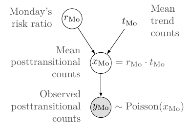

Loosely speaking, the arrows denote causal or logical dependencies, where the exact formula for the dependency is shown next to the nodes (in a canonical Bayes network, the formulas are described only in the text). The model can be translated into the following sentences:
 - The observed posttransitional AMI count on Monday follows a Poisson distribution.
 - The mean of the posttransitional AMI count on Monday is equal to the trend count on Monday, multiplied by the RR on Monday.
 - Monday's RR is a random variable, meaning it has an associated prior belief distribution (which we define below).

### Moving to a multi-day model

The reviewed literature performed hypothesis tests for every day of the posttransitional week – including weekends, sometimes noting a significant difference for Tuesday, but not Monday (Sandhu 2014). Such day-by-day tests of “statistical significance” need not concern themselves of _consistency_ – in the everyday sense of the word –, i.e. that prior to observations we expect any effect to be highest on Monday and wear off as time progresses.

When performing a Bayesian analysis, we _must_ have prior expectations on the expected parameter values – these prior beliefs are then changed according to the model and the observed data, resulting in the posterior distribution. In accordance with the literature, we assume that the effect is constrained to the posttransitional week, and that if there is an effect on Monday, there is some effect on Friday too. We expect no increase on Sunday, the day of the adjustment (after adjusting for the shorter day), because relatively few people wake up at the same time on Sundays (and sleep shorter as a consequence). On Tuesday, Wednesday, Thursday, Friday, we expect the relative increase to be 80%, 60%, 40%, 20% of the increase on Monday (see figure below) – this we call the “linear weekday model”. (This linear assumption will be weakened in a later analysis.) We denote the increase in RR on Monday with \(\theta\) (the only parameter of the model), thus \(r_\text{Mo} = 1 + \theta\), \(r_\text{Tu} = 1 + 0.8 \cdot \theta\), …, \(r_\text{Fr} = 1 + 0.2 \cdot \theta\).

The infarction counts on neighboring days are conditionally independent given \(\theta\) (apart from exceptional cases, such as a mass catastrophe), which means we can model the days separately and simply multiply their likelihoods. (Prior to observing the data, it feels _very_ unlikely to us that there would be any effect on Friday, but one paper attempted to measure effects on the 2 and 4 weeks following DST adjustment, meaning they didn't think such a long-lasting effect is completely implausible, therefore we consider including Friday as part of the expert opinion.)

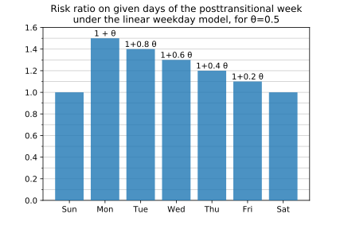

This model of all weekdays is described by the following graph:

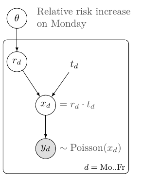

Here the rectangle means the nodes inside it should be repeated for \(d = \text{Mo}..\text{Fr})\) -- this rectangle is called a “plate”. A common parameter \(\theta\) determines \(r_d\) for a given day \(d\), which, together with \(t_d\), determines the number of expected AMIs (\(x_d\)) and actual AMIs (\(y_d\)).

### Prior beliefs about RR (spring)

We would like to estimate the value of a continuous parameter \(\theta\), where the standard procedure is to conduct a one-sided t-test, with the null hypothesis defined as \(\theta = 0\).

Gelman et al. (2013) suggest beginning Bayesian data analysis with a noninformative or _weakly informative prior_ – this avoid biasing the results to any particular value, and lets the posterior represent the data more closely.

I believe \(\theta\) is likely to be approximately \(0.0\) (i.e., \(\text{RR} \approx 1\), no effect), but it wouldn't be very surprising if \(\theta\) were positive. (I find it very unlikely, less than \(\approx 0.1\%\), that the RR decreases.) So I would like to place substantial probability mass close to 0.0, and spread the rest on values between \(0.0\) and \(1.0\) (\(P(\theta > 1.0) \lessapprox 0.1\%\)).

We can formalize this description by placing 50-50% of the prior probability mass of either there being zero effect (a Gaussian distribution with standard deviation of 0.01), or there being an increase in AMI counts, where the increase in RR has an Exponential(\(\lambda=0.2^{-1}\)) prior on it. (An Exponential(\(\lambda=0.2^{-1}\)) distribution has a mean of \(0.2\).) This distribution is plotted on the figure below.

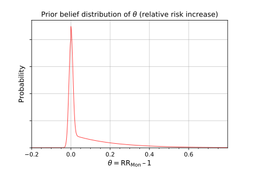

### Prior beliefs about the RR (autumn)

The AMI counts on the autumn posttransitional week used the same model as the spring counts, but it assumed an (improper) uniform prior on \(\theta\). (This prior is improper because no distribution exists that is uniformly distributed on the whole linear number line. In practice we would get the same posterior if we assumed a Uniform(−2,+2) prior.)

### Summary of assumptions

Every statistical test makes assumptions about the data, but in most reports using null hypothesis tests significance tests, these assumptions are never mentioned, instead they are implicit in the performed tests.
Therefore, statistics is often sold as a sort of alchemy that transmutes randomness into certainty, an “uncertainty laundering” that begins with data and concludes with success as measured by statistical significance (Gelman 2016).
I view it as a _strength_ of Bayesian data analysis that these assumptions must be stated explicitly. To summarize this section, we make the following assumptions in this analysis:

 1. Every region that use DST has the same RR in every year.
 2. Any effect is limited to the posttransitional weekdays, and the effect is highest on Monday, 20% less on Tuesday, and so on until 0% on Saturday.
 3. Our prior belief on the spring RR is split half-half between \(1.0\) and all values greater than \(1\), with the probability decaying exponentially at a rate of \(0.2^{-1}\). We make no prior assumptions about the autumn RR.

### Posterior calculations analytically

We performed our calculations for the fixed-effects model in spring analytically, using custom software written in Python. The result of these calculations was a 95% central credible interval, which is an interval of parameter values containing 95% of the posterior probability, with 2.5% on the negative and positive ends. This is not equal to the HDI when the distribution is skewed, but is usually a good approximation.

### Posterior calculations with Monte Carlo methods

We also performed our posterior calculations with Monte Carlo methods using the open source statistical modeling software [Stan](https://mc-stan.org/). Models in Stan are written using its own description language (which comes with [extensive documentation](https://mc-stan.org/users/documentation/) and a [supportive community](https://discourse.mc-stan.org/)), and they need to be first compiled into binary form using an interface in R, Python, or other languages. Then, after providing the observable data to the model, Stan draws samples from the posterior distribution of the parameters, and calculates the 95% highest posterior density interval (HDI, a.k.a. HPD) – the interval that covers the most plausible parameter values. For most practical purposes, 1000 independent samples would be enough, but we drew 50,000 samples to accurately assess the equality to the analytic solution.

The code for the fixed-effects linear weekday Stan model is as follows:

```stan
data {
  int DAYS;            // Number of days
  int STUDIES;         // Number of studies
  real NORMAL_SIGMA;   // The standard deviation of the normal component of the prior
  real EXPON_BETA;     // The beta parameter of the exponential component of the prior

  // The observed AMI counts and the trend predictions, for each day of each study
  int<lower=0> ami_obs[STUDIES, DAYS];
  real<lower=0> ami_trend[STUDIES, DAYS];
}

parameters {
  // Monday RR - 1.
  // (We cannot model RR_Mon directly because cannot assign a
  //   common distribution for that.)
  // Its probabilistic value is assigned in the model block below.
  real rr_Mon_minus_1;
}

transformed parameters {
  // The RR for every day
  real rr_day[DAYS];
  // The posttransitional AMI counts for every day of every study.
  real ami_dst_mean[STUDIES, DAYS];

  // Specifying the RR for every day, using the linear weekday model.
  for (i in 1:DAYS) {
    rr_day[i] = (rr_Mon_minus_1 * (DAYS + 1 - i) / DAYS) + 1;
  }

  for (s in 1:STUDIES) {
    for (i in 1:DAYS) {
      ami_dst_mean[s][i] = ami_trend[s][i] * rr_day[i];
    }
  }
}

model {
  // Mixture models are specified using the construct below:
  // target += log_sum_exp(c1 * XXX_lpdf(x | p1), c2 * YYY_lpdf(x | p2));
  target += log_sum_exp(normal_lpdf(rr_Mon_minus_1 | 0, NORMAL_SIGMA),
                        exponential_lpdf(rr_Mon_minus_1 | EXPON_BETA));

  // Finally, the observations are drawn from a Poisson distribution.
  for (s in 1:STUDIES) {
    for (i in 1:DAYS) {
      ami_obs[s][i] ~ poisson(ami_dst_mean[s][i]);
    }
  }
}
```

The `data` and `parameters` blocks declare the observed quantities and the unobserved parameters, without specifying their distribution.

The `transformed parameters` block contains all quantities that can be deterministically derived from the parameters.

The `model` block describes both the prior distributions for the parameters and the likelihood functions.

#### Sampling using the Python interface

We can compile the Stan model and sample from it in Python using [PyStan](https://pystan.readthedocs.io/). Once the software and its dependencies are installed, we can use the following code to draw 50,000 samples from the posterior and plot the results. On my computer, the model compilation takes about a minute, the sampling a few seconds.

```python
import pystan
import matplotlib.pyplot as plt

# 6-long list of 5-long lists integers (weekday observations)
all_obs = [[1735, 1644, 1555, 1522, 1467],  # Janszky and Ljung 2008
           [28, 28, 26, 23, 24],            # Jiddou et al. 2013
           ...
          ]

# 6-long list of 5-long lists floats
all_trend = ...

stan_data = {
    'STUDIES': 6,
    'DAYS': 5,
    'NORMAL_SIGMA': 0.01,
    'EXPON_BETA': 1/0.2,
    'ami_obs': all_obs,
    'ami_trend': all_trend
}

model = pystan.StanModel(model_file='dst_model.stan')

fit = model.sampling(data=stan_data, iter=50000)

print(pystan.stansummary())

plt.hist(fit['rr_day[1]']); plt.show()
```

#### Sampling using the R interface

The R interface of Stan is called [RStan](https://github.com/stan-dev/rstan/), and can be used as follows:

```r
library("rstan") # observe startup messages

stan_data <- list(STUDIES = 6,
                  DAYS = 5,
                  NORMAL_SIGMA = 0.01,
                  EXPON_BETA = 1/0.2,
                  ami_obs = all_obs,
                  ami_trend = all_trend)

fit <- stan(file = 'dst_model.stan', data = stan_data, iter = 50000)

hist(extract(fit)$$rr_day[1]
```

### Effect of study size in a Bayesian framework

For a small study, i.e. if the trend and observed AMI counts are low, we want to see a very slight change in the prior; for a large study, we want to see a bigger change.

Two factors should play into this. First, if the trend predicts low counts, then we are likely to observe relatively big fluctuations: observing 12 heart attacks on a day when the long-term average is 10 represents a +20% increase, yet it occurs once every 3 days on average. Second, if the study was small and the trend is estimated from only a few weeks’ data, our _estimate_ of the trend itself has greater variance. This second factor is not yet modeled in our work, but in small studies like that of Čulić (2013), this too could play a role.

To see the difference between a small and a large study, we visualize the prior and the posterior for the following scenarios:

- Observation higher than trend, small sample size (top left);
- Observation equals trend, large sample size (top right);
- Observation lower than trend, large sample size (bottom left);
- Observation higher than trend, large sample size (bottom right).

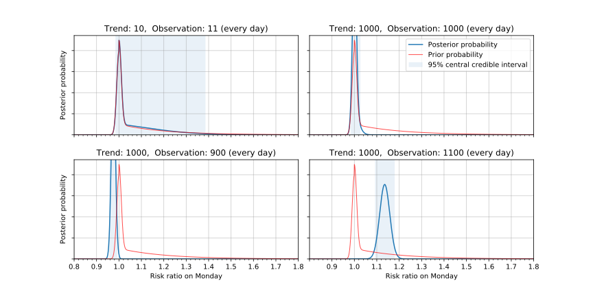

When the sample size is small, there is only a slight change from prior to posterior. With a large sample size, the prior beliefs barely have an effect on the posterior. (In the lower right plot, the posterior peaks at more than 1.1 because with 1100 AMI every day, the linear weekday model fits better with a larger RR.)

## Results

### Relevant studies

The list of studies analyzed are identical to those analyzed in (Manfredini et al., 2019):
- Janszky and Ljung (2008)
- Janszky et al. (2012)
- Čulić (2013)
- Jiddou et al. (2013)
- Sandhu et al. (2014)
- Kirchberger et al. (2015)
- Sipilä et al. (2016)

We excluded the study of Janszky et al. (2012), as the population is a strict subset of (Janszky and Ljung, 2008), with no additional information that is relevant for our analysis. The meta-analysis of Manfredini et al. (2019) did not exclude this study, which biased their results significantly, as the population size of this study is the second largest of all.

Key characteristics of the above studies can be found in the table below, with more details in the appendix.

| Paper | Sun | Mon | Tue | Wed | Thu | Fri | Sat |
| --- | --- | --- | --- | --- | --- | --- | --- |
| (Janszky and Ljung, 2008) | (1374) | (1636) | (1494) | (1471) | (1484) | (1422) | (1370) |
|     | 1439 | 1735 | 1644 | 1555 | 1522 | 1467 | 1414 |
| (Jiddou et al., 2013) | (13) | (29) | (20) | (23) | (17) | (25) | (16) |
|     | 23 | 28 | 28 | 26 | 23 | 24 | 18 |
| (Čulić, 2013) | (6) | (7) | (6) | (7) | (6) | (6) | (5) |
|     | 5 | 14 | 6 | 9 | 6 | 5 | 8 |
| (Kirchberger et al., 2015) | (70) | (70) | (70) | (70) | (70) | (70) | (70) |
|     | 66 | 85 | 83 | 76 | 77 | 85 | 60 |
| (Sandhu et al., 2014) | (111) | (138) | (127) | (125) | (120) | (120) | (110) |
|     | 108 | 170 | 125 | 122 | 117 | 117 | 114 |
| (Sipilä et al., 2016) | (208) | (269) | (243) | (259) | (227) | (227) | (198) |
|     | 201 | 229 | 253 | 254 | 262 | 242 | 179 |

_(Spring AMI counts. Trend predictions in parentheses, under them the number of incidences on the posttransitional week. Total count on the posttransitional week: 14,024.)_

| Paper | Sun | Mon | Tue | Wed | Thu | Fri | Sat |
| --- | --- | --- | --- | --- | --- | --- | --- |
| (Janszky and Ljung, 2008) | (1780) | (2140) | (1991) | (1910) | (1941) | (1949) | (1781) |
|     | 1777 | 2038 | 1958 | 1895 | 1916 | 1977 | 1732 |
| (Jiddou et al., 2013) | (18) | (24) | (21) | (27) | (22) | (24) | (20) |
|     | 11 | 34 | 25 | 19 | 20 | 18 | 30 |
| (Kirchberger et al., 2015) | (67) | (67) | (67) | (67) | (67) | (67) | (67) |
|     | 60 | 57 | 77 | 73 | 77 | 84 | 60 |
| (Sandhu et al., 2014) | (86) | (107) | (99) | (97) | (93) | (93) | (85) |
|     | 89 | 102 | 79 | 93 | 104 | 86 | 99 |
| (Sipilä et al., 2016) | (159) | (197) | (193) | (170) | (201) | (178) | (157) |
|     | 160 | 214 | 180 | 198 | 199 | 172 | 153 |
| (Čulić, 2013) | (6) | (7) | (6) | (7) | (6) | (6) | (5) |
|     | 7 | 9 | 12 | 6 | 12 | 5 | 4 |

_(Autumn AMI counts. Trend predictions in parentheses, under them the number of incidences on the posttransitional week. Total count on the posttransitional week: 15,921.)_

### AMI risk after spring transition

The posteriors after the individual papers are shown below, along with their 95% central credible interval (CCrI).

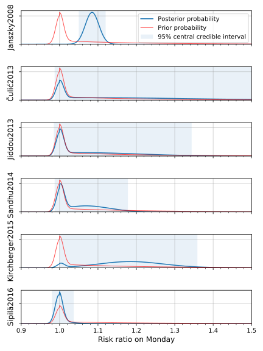

The width of the 95% CCrI is a measure of the precision of the estimate. The 95% CCrI after (Janszky and Ljung, 2008) and (Sipilä et al. 2016) are comparably narrow, but they are centered around 1.085 and 1.001, respectively. In fact, as we can see from the likelihood functions (not shown here), the study of Sipilä et al. (2016) presents a case for a slight _decrease_ in AMI risk under this model.

In the fixed effects model the posterior is weighted heavily towards the study with the largest sample size (Janszky and Ljung 2008), and the other studies barely play a role.
Specifically, the posterior mean of the RR is 107.7% (95% central credible interval: \([104.7\%, 110.7\%]\)) – the posterior is shown below. We emphasize again that the relative weights of the studies is not arbitrary, but is fully determined by the model and the data through the rules of probability theory.

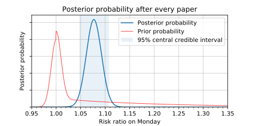

We arrive at the same posterior when drawing samples from it through a Monte Carlo method with Stan. Furthermore, as the tails of posterior are symmetric, the 95% highest density interval of \[104.8%, 110.7%\] closely aligns with the 95% central credible interval obtained earlier (\[104.7%, 110.7%\]). (This fact merely verifies that the two methods compute the model correctly, it does not provide additional evidence about the quality of the data.)

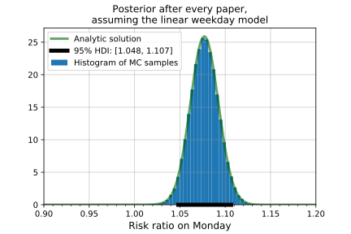

The studies together provide so many data points that the choice of prior does not play an important role. Assuming a uniform prior on the risk ratio, i.e. assuming that we have no more _prior_ evidence for +2% than for +20% or −30% change in risk, we arrive at practically the same posterior, and a 95% HDI of \[104.7%, 110.7%\].

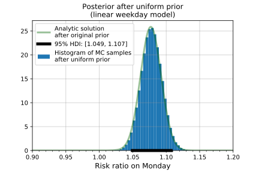

#### Exponential weekday model

The exponential weekday model relaxes the assumption of linear decrease in RR throughout the week, and instead models the daily RRs as exponentially decreasing. That is, for a parameter \(\alpha \in [0,1]\), the risk ratios are determined as:
 - \(r_\text{Mon} = 1 + \theta\),
 - \(r_\text{Tue} = 1 + \alpha \cdot \theta\),
 - \(r_\text{Wed} = 1 + \alpha^2 \cdot \theta\),
 - etc.

Assuming a uniform prior on both \(\alpha\) and \(\theta\), the posterior for this model looks as follows:

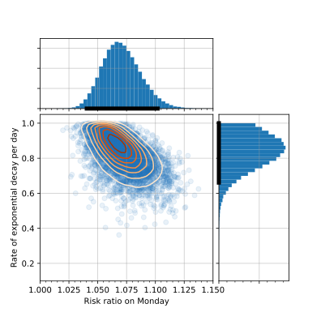

I expected the posterior on \(\alpha\) to be centered much closer to zero (meaning a rapid decrease in risk after Monday), but the posterior shows the opposite: most of the plausible values of \(\alpha\) correspond to an \(r_\text{Fri} / r_\text{Mon}\) ratio greater than the 0.2 ratio assumed previously (\(0.7^4 \approx 0.24\)). The 95% HDI for \(\theta\) is \[104.0%, 110.2%\] (mean 107.1%), which is close to the linear weekday model, and the 95% HDI for \(\alpha\) is \[0.66, 1.0\] (mean 0.83). The figure below shows the risk ratios over the week for 20 of the sampled combinations of \((\alpha, \theta)\).

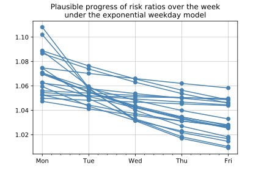

Over the five weekdays this posterior corresponds to an average risk ratio of 105.0% (95% HDI: \[103.1%, 107.0%\]). Assuming an affected population of 1.6 billion globally, with AMI rates standard across the USA [\(^\textsf{[source]}\)](https://www.cdc.gov/heartdisease/heart_attack.htm), this means that over the whole posttransitional week the an additional 2700 people experience AMI (95% HDI: \[1600, 3700\]), on top of the regular 53,000 per week.

### AMI risk after autumn transition

The posterior for the autumn data, using the linear weekday model with uniform prior on \(\theta\) is shown below. The 95% HDI of \[95.1%, 100.3%\] suggests a decrease in AMI risk, but the hypothesis of “no change in risk” (\(\theta = 100.0\%\)) is also compatible with the data.

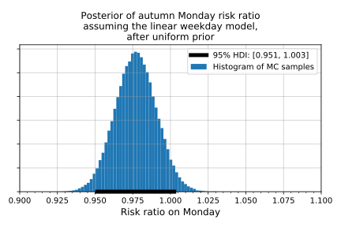

Globally, this translates to a change of AMI counts over the whole week of −700 (95% HDI \[−1600, +100\]), from the original 53,000.

## Visualizing the observations and the posterior predictive distribution

### Posterior predictive distribution

In the figure below we visualize the posterior predictive distribution (for each day of each paper) on the spring posttransitional week, together with the actual observations.

These predictive distributions on \(\tilde y\) can be calculated by integrating the likelihoods \(P(\tilde y \given \theta)\) over the parameter space, weighted by the posterior probability of the parameter values \(p(\theta \given \mathcal D)\), using the following formula:

\[P(\tilde y \given \mathcal D) =
\int P(\tilde y \given \theta, \mathcal D) \,d\theta =
\int P(\tilde y \given \theta) p(\theta \given \mathcal D) \,d\theta\]


_(Posterior predictive distribution for spring.)_

Only the Monday observation of (Sipilä et al., 2016) falls out of the 95% central credible interval (CCrI), and in addition the Thursday observation of (Sipilä et al., 2016) and the Monday observation of (Čulić, 2013) falls out of the 90% CCrI (shown [here](figs/posterior_predictive_90.svg)), indicating a good fit of the model.

## Further research

The importance of this issue depends on whether the increase in AMIs on the posttransitional week is merely a shift from the weeks afterwards. In other words, how many of these additional AMIs would have been asymptomatic, had it not been for the DST? We suspect that this number is quite low, because effectively the transition shifts the sleep schedule by an hour, which happens relatively often (e.g. when traveling), and single-day sleep deprivations are even more common. One way to approach this question is to collect the AMI counts in the few weeks following a DST transition, and compare the results obtained from regions with DST and regions without DST.

The main deficiency of this meta-analysis is the assumption of equal effects regardless of country, while using the fixed effects model. This assumption could be relaxed in a random effects model, although that would introduce a subjective choice of inter-country variance, making the results harder to interpret correctly and simpler to misinterpret.<sup>[[fn-1]](#fn-misinterpret)<a id="fn-src-misinterpret"></a> ↓</sup>

As the absolute effect of DST transitions on AMI incidences is not substantial (given the low base rate), even on a global scale, I suggest no further research on this specific topic.<sup>[[fn-2]](#fn-further)<a id="fn-src-further"></a> ↓</sup> There are many research areas around either sleep or cardiovascular health that are more important.

## Conclusion

A standard argument against Bayesian methods is that the subjective choice of prior influences the results arbitrarily. Although this is a philosophical question, we believe meaningful and consistent probabilistic inference cannot be done without describing our initial beliefs and defining how different parameter values would result in different observations. However, in our case the likelihood of the observed data dominated the prior, rendering the choice of prior almost irrelevant.

Our analysis showed an increase in AMI risk during spring (relative risk increase 5–11% on Monday, less on later days), which translates to an additional 1600–3700 AMI incidences over the whole affected period. The data from the autumn transition showed either no change or a slight decrease in AMI risk (at most 5% relative risk decrease), translating to an estimated change in incidence counts somewhere between −1600 and +100.
These figures alone do not provide an argument against the institution of DST, especially without evidence that these changes are not merely the result of future AMI incidences advanced (in spring) or postponed (in autumn), which is the default position.
However, the analysis provides strong evidence for the hypothesis that our body can react negatively to a single hour shift in our sleep cycles, which should be a crucial factor in the evaluation of DST, and shows the importance of a consistent sleep schedule.

## License

<a rel="license" href="http://creativecommons.org/licenses/by/4.0/"></a><br /><i><span xmlns:dct="http://purl.org/dc/terms/" property="dct:title">The effects of daylight savings time adjustment on the incidence rate of acute myocardial infarction: a Bayesian meta-analysis</span></i> by <a xmlns:cc="http://creativecommons.org/ns#" href="https://treszkai.github.io/2019/11/11/dst-vs-ami" property="cc:attributionName" rel="cc:attributionURL">Laszlo Treszkai</a> is licensed under a <a rel="license" href="http://creativecommons.org/licenses/by/4.0/">Creative Commons Attribution 4.0 International License</a> (CC-BY-4.0).

The data presented in the [Relevant studies](#Relevant-studies) section belong to the original authors and they do not fall under the above CC-BY-4.0 license.

The software used for this analysis is distributed under the MIT license.

Please cite this work as follows:

Laszlo Treszkai. 2019. _The effects of daylight savings time adjustment on the incidence rate of acute myocardial infarction: a Bayesian meta-analysis_. <http://treszkai.github.io/2019/11/11/dst-vs-ami>

BibTeX:

```bibtex
@misc{,
  title = {The effects of daylight savings time adjustment on the incidence rate of acute myocardial infarction: a {B}ayesian meta-analysis},
  author = {Laszlo Treszkai},
  howpublished = {\url{http://treszkai.github.io/2019/11/11/dst-vs-ami}},
%  note = {Accessed: yyyy-mm-dd}  % Optional. The document at this URL is not going to change.
  year = {2019}
  month = {oct}
}
```

# References


Cumming, G. (2014). _The new statistics why and how._ Psychological Science, 25(1), 7–29.

Andrew Gelman, John B. Carlin, Hal S. Stern, David B. Dunson, Aki Vehtari, and Donald B. Rubin. 2013. _Bayesian Data Analysis._ [link](http://www.stat.columbia.edu/~gelman/book/)

Ronald L. Wasserstein, Nicole A. Lazar. 2016. _The ASA Statement on p-Values: Context, Process, and Purpose._ The American Statistician. Volume 70, Issue 2, pp. 129-133. [link (OA)](https://doi.org/10.1080/00031305.2016.1154108)

Ronald L. Wasserstein, Allen L. Schirm & Nicole A. Lazar. 2019. _Moving to a World Beyond “p < 0.05”._ Volume 73, pp. 1–19. [link (OA)](https://doi.org/10.1080/00031305.2019.1583913)

John K. Kruschke, Torrin M. Liddell, 2018. _The Bayesian New Statistics._  Psychonomic Bulletin & Review. Volume 25, Issue 1, pp 178–206. [link (OA)](https://link.springer.com/article/10.3758/s13423-016-1221-4)

Amneet Sandhu, Milan Seth, Hitinder S. Gurm. 2014. _Daylight savings time and myocardial infarction._ Open Heart. [link](http://dx.doi.org/10.1136/openhrt-2013-000019)

Roberto Manfredini, Fabio Fabbian, Rosaria Cappadona, Alfredo De Giorgi, Francesca Bravi, Tiziano Carradori, Maria Elena Flacco, Lamberto Manzoli. 2019.
_Daylight Saving Time and Acute Myocardial Infarction: A Meta-Analysis_. Journal of Clinical Medicine. 2019, _8_, 404; [link](https://www.ncbi.nlm.nih.gov/pmc/articles/PMC6463000/)

Kirchberger et al. 2015. _Are daylight saving time transitions associated with changes in myocardial infarction incidence? Results from the German MONICA/KORA Myocardial Infarction Registry_. BMC Public Health. 2015; 15: 778. [link](https://www.ncbi.nlm.nih.gov/pmc/articles/PMC4535383/)

Janszky and Ljung. 2008. _Shifts to and from Daylight Saving Time and Incidence of Myocardial Infarction_. The New England Journal of Medicine.  BMC Public Health. 359; 18. [link](https://www.nejm.org/doi/full/10.1056/NEJMc0807104)

Viktor Čulić. 2013. _Daylight saving time transitions and acute myocardial infarction_. Chronobiology International. 2013; 30(5): 662–668. [link](https://www.tandfonline.com/doi/abs/10.3109/07420528.2013.775144)

Janszky, Ahnve, Ljung, Mukamal, Gautam, Wallentin, Stenestrand. 2012. _Daylight saving time shifts and incidence of acute myocardial infarction – Swedish Register of Information and Knowledge About Swedish Heart Intensive Care Admissions (RIKS-HIA)_. Sleep Medicine 13 (2012) 237–242. [link](https://www.sciencedirect.com/science/article/abs/pii/S1389945711003832)

Monica R. Jiddou, MD, Mark Pica, BS, Judy Boura, MS, Lihua Qu, MS, and Barry A. Franklin, PhD. 2013. _Incidence of Myocardial Infarction With Shifts to and From Daylight Savings Time_. The American Journal of Cardiology. Volume 111, Issue 5, Pages 631–635. [link](http://dx.doi.org/10.1016/j.amjcard.2012.11.010)

Jussi O.T. Sipilä, Päivi Rautava & Ville Kytö. 2016. _Association of daylight saving time transitions with incidence and in-hospital mortality of myocardial infarction in Finland_. Annals of Medicine, 48:1-2, 10-16. [link](http://dx.doi.org/10.3109/07853890.2015.1119302)

Young Joo Yang, Chang Seok Bang, Gwang Ho Baik, Tae Young Park, Suk Pyo Shin, Ki Tae Suk, Dong Joon Kim. 2017.
_Prokinetics for the treatment of functional dyspepsia: Bayesian network meta-analysis_.
BMC Gastroenterology 17:83 DOI 10.1186/s12876-017-0639-0. [link (OA)](https://bmcgastroenterol.biomedcentral.com/track/pdf/10.1186/s12876-017-0639-0)

Xiaole Su, Xinfang Xie, Lijun Liu, Jicheng Lv, Fujian Song, Vlado Perkovic, Hong Zhang. 2017.
_Comparative Effectiveness of 12 Treatment Strategies for Preventing Contrast-Induced Acute Kidney Injury: A Systematic Review and Bayesian Network Meta-analysis_
Volume 69, Issue 1, pp. 69–77.
DOI: 10.1053/j.ajkd.2016.07.033, [link](https://www.ajkd.org/article/S0272-6386(16)30421-8/fulltext)

Devin Incerti. 2015. _Bayesian Meta-Analysis with R and Stan_. Self-published, online. https://devinincerti.com/2015/10/31/bayesian-meta-analysis.html. Retrieved 4 Oct 2019.

---------------------

# Appendix

## Characteristics of studies

### Janszky and Ljung (2008)

**Data**:
 - source: the Swedish registry of acute myocardial infarction (“which provides high-quality information on all acute myocardial infarctions in the country since 1987”)
 - years: 1987–2006
 - observations: the incidence of AMI during each of the first 7 days after the spring or autumn transition
 - trend: the mean of the incidences on the corresponding weekdays 2 weeks before and 2 weeks after the day of interest
 - total AMI cases on spring posttransitional week: 10,776

**Quotes**:

> The effects of transitions were consistently more pronounced for people under 65 years of age than for those 65 years of age or older.

The authors properly controlled for the Easter holiday.
> Analyses of the data for the spring shift are based on the 15 years between 1987 and
2006 in which Easter Sunday was not the transition day.
> [...]
> For years in which Easter
Sunday was celebrated 2 weeks after the Sunday of the spring shift, we defined the control period for the Sunday of
the shift as the Sunday 3 weeks before and the Sunday 3 weeks after (thus skipping Easter Sunday).

**Overanalysis**:

The following observations do not have any plausible explanation, and are probably just noise. Question: did later studies confirm these findings?

1.
> When we did not exclude Easter if it coincided with the exposure or control days, we observed an even higher effect size associated with the spring transition.

2.
> For the autumn shift, in contrast to the analyses of all acute myocardial infarctions, analyses restricted to fatal cases showed a smaller decrease in the incidence of acute myocardial infarction on Monday, and the risk of fatal acute myocardial infarction increased during the first week after the shift.

3.
> The effect of the spring transition to daylight saving time on the incidence of acute myocardial infarction was somewhat more pronounced in women than in men, and the autumn effect was more pronounced in men than in women.


**Additional information**:

The authors were employed by institutions in Stockholm, Sweden, meaning the use of the Swedish registry is *no evidence for selection bias*. Furthermore, the end of the 30-year period of their study is only a year away from the date of the publication.

### Janszky et al. (2012)

**Data**:
 - those AMI patients who were admitted to CCUs at participating hospitals
 - from 1995 to 2007
 - dataset: Register of Information and Knowledge about Swedish Heart Intensive Care Admissions (RIKS-HIA)
 - total AMI cases during spring posttransitional week: 3235.9

This study didn't publish per-day AMI counts, only the total during the whole posttransitional week.

The time period matches exactly that of Janszky and Ljung (2008), and every case included in this study was also included in Janszky and Ljung (2008). As such, this study doesn't add new information to the previous work with regards to the variables we consider, and it is **excluded from our meta-analysis** in order to avoid double-counting.

As the authors put it:

> The study populations of the present and our previous study
overlapped substantially. Our previous analyses included all AMIs
detected either at a hospital or at an autopsy in Sweden from
1987 to 2006, a clear strength. In the present work, we investigated
only those AMI patients who were admitted to CCUs at participating
hospitals from 1995 to 2007. Although this limited our power
substantially, it allowed us to examine clinical factors that might
modify the risks related to DST transitions.

### Čulić (2013)

**Data**:

- patients hospitalized because of AMI
- from 1990 to 1996
- 40 patients on workdays following DST change
- at University Hospital Centre Split in Split, Croatia

It is unclear whether the trend prediction is made from the 2 weeks before and after the posttransitional week, or from all 50 nontransitional weeks:

> The incidence ratios of AMI for the first week after the
two DST shifts (posttransitional weeks) and each day of
that week were estimated by dividing the incidence
during those periods with the average incidences during
corresponding days and weeks throughout the year: 2
wks before and 2 wks after the posttransitional week,
and the 50 nontransitional weeks of the year altogether.

It is unclear why exactly the data from 1990 to 1996 was analyzed, if the study was conducted in 2013. This is *suggestive of selection bias*.

**Overanalysis**:

23 additional variables were analyzed (sex, employment status, use of β-blocker, etc.); some were bound to have low p-values:

> The independent predictors for AMI during
this period in spring were male sex (p = 0.03) and nonengagement in physical activity (p = 0.02) and there was a trend
for the lower risk of incident among those taking calcium antagonists (p = 0.07). In autumn, the predictors were
female sex (p = 0.04), current employment (p = 0.006), not taking b-blocker (p = 0.03), and nonengagement in
physical activity (p = 0.02).

### Jiddou et al. (2013)

**Data**:
- a retrospective electronic chart review
- all patients presenting to the emergency centers at Beaumont Hospitals in Royal Oak and Troy, Michigan, with the primary diagnosis of AMI
- age: patients who were aged >18 years, resulting in 70±15 years
- exclusion conditions: minor, pregnant
- from October 2006 to April 2012 (7 years)
- trend: patients admitted with comparable diagnoses on the corresponding weekdays 2 weeks before and 2 weeks after the shifts to and from DST
- additional variables: demographic data, medical history, tobacco use, prescribed medications, whether the patient underwent cardiac catheterization; diagnosis of hypertension, hyperlipidemia, and coronary artery disease.

**Quotes**:

> 2 AMIs occurred on Easter Sunday and were considered potential confounders and excluded.

It is correct to note the incidences on Easter Sunday, but even more important would be the incidences on Easter _Monday_. But even then, is only correct to exclude the patients entirely if the relevant control incidences are also reduced – it is unclear whether this trend correction happened.

### Sandhu et al. (2014)

**Data**:
 - Time: 1 January 2010 – 15 September 2013 (3 fall and 4 spring DST changes; 1354 days)
 - Procedural data for hospital admissions where PCI was performed in the setting of AMI
 - Number of cases: 42,060 hospital admissions for AMI requiring PCI occurred during the study period.
 - The median daily AMI total was 31, ranging from a minimum of 14 to a maximum of 53 admissions.

**Results**:

> There was no difference in the total weekly number of PCIs performed for AMI for either the fall or spring time changes in the time period analysed. After adjustment for trend and seasonal effects, the Monday following spring time changes was associated with a 24% increase in daily AMI counts (p=0.011), and the Tuesday following fall changes was conversely associated with a 21% reduction (p=0.044). No other weekdays in the weeks following DST changes demonstrated significant associations.

**Analysis**:

I was unable to obtain the data at [Blue Cross Blue Shield of Michigan](https://bmc2.org) and the study did not include the number of AMI cases numerically, therefore I estimated it from the chart in Figure 3 (which was accurate to 0.4 AMI).

### Kirchberger et al. (2015)

**Data**:
- AMI count: 25,499 cases of AMI
- data source: MONICA/KORA Myocardial Infarction Registry ([link](https://www.helmholtz-muenchen.de/herzschlag-info/); public data should be published yearly according to [this website](http://www.gbe-bund.de/gbe10/abrechnung.prc_abr_test_logon?p_uid=gast&p_aid=0&p_knoten=FID&p_sprache=E&p_suchstring=7014), but I did not find a link to download the dataset)
- time period: 1 January 1985 and 31 October 2010 (26 spring and 25 fall DST changes – 2010 fall adjustment was on 31 October)
- ages: 25–74
- includes: coronary death and AMI
- location: city of Augsburg (Germany) and the two adjacent counties (about 600,000 inhabitants)
- additional variables: information on re-infarction, various medication prior to AMI, current occupation, history of hypertension, hyperlipidemia, diabetes, smoking, and obesity.
- confounders accounted for: global time trend, temperature, relative humidity, barometric pressure, and indicators for month of the year, weekday and holiday

**Quotes**:

> The final model included the following covariates: time trend and previous two day mean relative humidity as regression splines with four and two degrees of freedom, respectively, previous two day mean temperature as a linear term and day of the week as categorical variable.

> The optimized spring model [of the data from March and April, excluding the week in question] included time trend and same day mean relative humidity as regression splines with six and three degrees of freedom.

Six d.o.f. for 2 months is probably overfitting the data, even though it was the sum of 26 years. However, it shouldn’t make a predictible effect, and its overall effect is probably negligible.

> The incidence rate ratio was assessed as observed over expected events per day and the mean per weekday and corresponding 95% confidence intervals were calculated.

However, it is not stated how the confidence intervals were calculated: most importantly, which statistical test was used?

**Analysis**:

The paper stated only the calculated RRs for the spring and autumn prediction models (for all seven days), not the actual AMI counts.
Assuming the researchers analyzed the data in an honest manner (i.e. not picking model parameters for lower trend prediction and thus more significant observed increase), and that the model didn't predict large deviations from the 2.7 AMI/day average, we can calculate a close approximation of the observations as \(\mathrm{RR}_d \cdot \mathrm{trend}\).

### Sipilä et al. (2016)

**Data**:
 - years: 2001–2009, except 2002 and 2005 (due to Easter). 7 years.
 - Exclusion criterion: age < 18.
 - Age: mean age 71.2, SD 12.6 years
 - 2 weeks prior and 3 weeks after DST transition
 - all 22 Finnish hospitals with coronary catheterization laboratory that treat emergency cardiac patients
 - database: Finnish Care Register for Health Care (CRHC), a nationwide, obligatory and automatically collected hospital discharge database.

 - Study group: posttransitional week
 - Control group: 2 weeks before/after posttransitional week
 - Easter in study group: 2002, 2005. “Years with DST spring transition on Easter Sunday were excluded from the analysis (2002 and 2005) to increase international comparability and avoid confounding”
 - Easter in control group: “When Easter Sunday was celebrated within 2 weeks after DST transition, post-DST control weeks after Easter were selected.”
 - Spring study+control group size: 1269+5029 = 6298
 - Standardized incidence of MI admissions in participating hospitals during spring study period was 259/100,000 person-years.


**Quotes**:

> Incidence of MI admissions was similar to control
weeks for Sunday–Tuesday after DST transition
(Figure 1). However, on fourth day after transition
(Wednesday), there was a significant increase in MI
incidence compared to control weeks (IR 1.16; CI 1.01–
1.34).

Is there anything special about the _Wednesday_ that follows a DST transition? One should not be surprised if a value falls outside of a 95% confidence/credible interval – after all, it happens _at least_ 5% of the time even in the absence of any "interesting" effect.

> Patients admitted
during the week after DST transition were less likely to
have diagnosed diabetes or ventricular arrhythmias
compared to patients admitted during control weeks,
but had diagnosed renal failure more often.

There is no simple and plausible explanation for this, therefore it is more probable that this is a result of finding patterns in noise.

> Population-based incidence
of MI admissions to participating hospitals during
spring and autumn periods were calculated using
corresponding population data of mainland Finland
obtained from Statistics Finland and standardized to
European standard population 2013 by using the direct
method.

The meaning of the above statement is unclear.

## Footnotes

#### Footnote 1

“Sleep researchers show a 20% increase in risk of heart attacks in Michigan but a 10% decrease in Finland, so it is advised to travel to Europe for this week.”

[[back to source]](#fn-src-misinterpret) ↑

#### Footnote 2

Originally, I wrote the following:

> Further research could analyze the publication bias (if you know how to do that in a Bayesian framework, please mention it in the comments below), or analyze more data, preferably from multiple countries. Maybe the DST transition has a smaller effect on the Finnish population than on the Swedish population, which could easily be analyzed using Bayesian statistics.

But then I calculated the absolute global effect, which is quite small, therefore the updated recommendation.

[[back to source]](#fn-src-further) ↑
